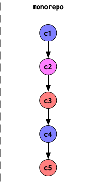
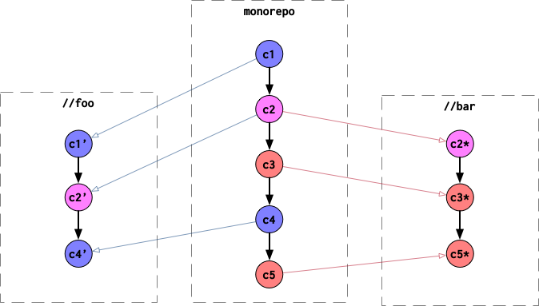

# `cec_exports_repo`: Bazel subproject export

## Overview

This project provides a bazel rule for exporting the git history for a subset of targets in a workspace as a separate repository.

I made this tool to export sub-projects from a large git repository as separete git repositories. For example, let's say you have a monorepo in which there are five commits `c1`-`c5`:



Let's say there are two packages `//foo` and `//bar` which you would like to export as their own repositories. Commits `c1` and `c4` touch files in `//foo`, `c3` and `c5` touch `//bar`, and `c4` touches files which are common to both. Using `exports_repo`, you can create export actions, which, when executed create new git repositories containing only the history for the relevant files:




## Getting Started

Add the following to your WORKSPACE file:

```py
load("@bazel_tools//tools/build_defs/repo:http.bzl", "http_archive")

http_archive(
    name = "cec_exports_repo",
    urls = ["https://github.com/ChrisCummins/exports_repo/archive/2020.05.06.tar.gz"],
    sha256 = "338001b0e2e3cea978b72a456ac201b86042aecbbbdb779694ac4b131e949fc2",
    strip_prefix = "exports_repo-2005.05.06",
)

load("@cec_exports_repo//tools/bzl:deps.bzl", "cec_exports_repo_deps")
cec_exports_repo_deps()
```


In your BUILD file, define an `exports_repo` target:

```py
load("@cec_exports_repo//tools/bzl:exports_repo.bzl", "exports_repo")

exports_repo(
    name = "export",
    remote = "git@github.com:ChrisCummins/exports_repo_example.git",
    targets = ["//myapp/..."],
    path_rename = {
        "myapp/README.md": "README.md"
    },
)
```

Run this new target to perform the export:

```sh
$ bazel run //myapp:export --define=workspace=$(pwd)
```

**Note you must `--define` the path of the workspace.** This is becasue the repo export is non-hemetic and works by cloning the workspace repository.


## Usage


### exports_repo

```py
exports_repo(name, remote, branch, targets, paths, path_remove, path_rename, tag_rename, always_export_path)
```

An executable rule that exports the git history for a subset of targets and paths.

This is a non-hemetic process which:

1. Identifies the subset of files that will be exported by evaluating the source and build files of the listed `targets`.
2. Creates a temporary local clone of the current repository.
3. Re-writes the history of this clone to include only the subset of required files.
4. Force-pushes the rewritten history to `remote/branch`.

<table class="table table-condensed table-bordered table-params">
  <colgroup>
    <col class="col-param" />
    <col class="param-description" />
  </colgroup>
  <thead>
    <tr>
      <th colspan="2">Attributes</th>
    </tr>
  </thead>
  <tbody>
    <tr>
      <td><code>name</code></td>
      <td>
        <code>Name, required</code>
        <p>A unique name for this rule.</p>
      </td>
    </tr>
    <tr>
      <td><code>remote</code></td>
      <td>
        <code>String, required</code>
        <p>Git remote to export to.</p>
        <p>
          The URL of a git remote that the resulting repository is force pushed to.
        </p>
      </td>
    </tr>
    <tr>
      <td><code>branch</code></td>
      <td>
        <code>String, default to "master"</code>
        <p>
          The name of the remote branch that is pushed.
        </p>
      </td>
    </tr>
    <tr>
      <td><code>targets</code></td>
      <td>
        <code>List of labels, optional</code>
        <p>The labels to export.</p>
        <p>
          A list of bazel labels which are used to resolve the files to export. The source and build files for each target and its dependencies are used to resolve the subset of files to export.
        </p>
      </td>
    </tr>
    <tr>
      <td><code>paths</code></td>
      <td>
        <code>List of files, optional</code>
        <p>Additional paths to export.</p>
        <p>
          A list of additional files to export. All file paths are relative to the workspace root.
        </p>
      </td>
    </tr>
    <tr>
      <td><code>path_remove</code></td>
      <td>
        <code>List of files, optional</code>
        <p>Files to exclude from export.</p>
        <p>
          A list of files to exclude from export. All file paths are relative to the workspace root.
        </p>
      </td>
    </tr>
    <tr>
      <td><code>path_rename</code></td>
      <td>
        <code>Dictionary, optional</code>
        <p>A mapping of paths to rename.</p>
        <p>
          A dictionary of paths to rename during export. All file paths are relative to the workspace root.
        </p>
      </td>
    </tr>
    <tr>
      <td><code>tag_rename</code></td>
      <td>
        <code>String, optional</code>
        <p>A tag renaming pattern.</p>
        <p>
          A tag renaming pattern that is passed to git-filter-repo. The format for renaming patterns is &lt;old:new&gt;, and is used to subsitutute a prefix. For example, "foo:bar" will rename tag "foo-1.2.3" to "bar-1.2.3"; either &lt;old&gt; or &lt;new&gt; can be empty. For example, ":foo-" will rename tag "1.2.3" to "foo-1.2.3".
        </p>
      </td>
    </tr>
    <tr>
      <td><code>always_export_path</code></td>
      <td>
        <code>File, default to "tools/always_export.txt"</code>
        <p>Path of a file containing additional paths to export.</p>
        <p>
          A file which contains a list of additional paths which are implicitly added to the "paths" attribute. The file is ignored if it is not found. File path is relative to the workspace root.
        </p>
      </td>
    </tr>
  </tbody>
</table>


## Credits

The heavy lifting is done by the excellent [git-filter-repo](https://github.com/newren/git-filter-repo), I simply provide glue code which uses bazel query to feed it with commands.


## License

Made with ❤️ by Chris Cummins. Released under MIT License.
